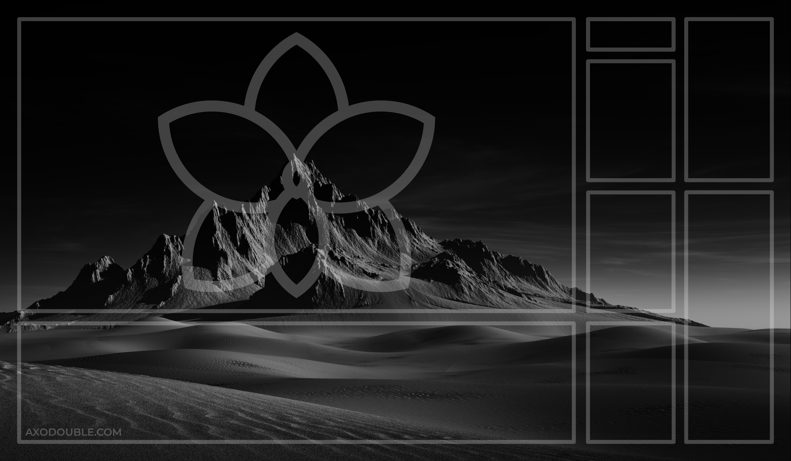

# Magic The Gathering stuff

I designed a 60x35 (23.6"x13.7") mat for playing Magic The Gathering.
It has a place for your library, graveyard, commander, commander tax, exile, land cards and battlefield. It also has a (currently) misc field top right for whatever you want to put there.

The mat is designed to allow for you to put whatever background you'd like.

## Examples

Here are some examples of the mat in use:

